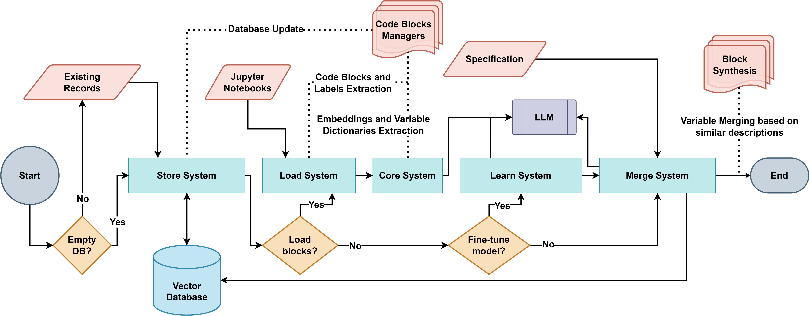
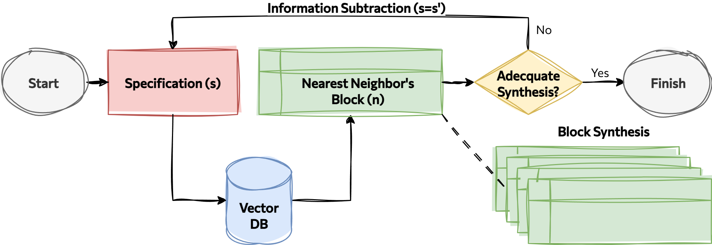
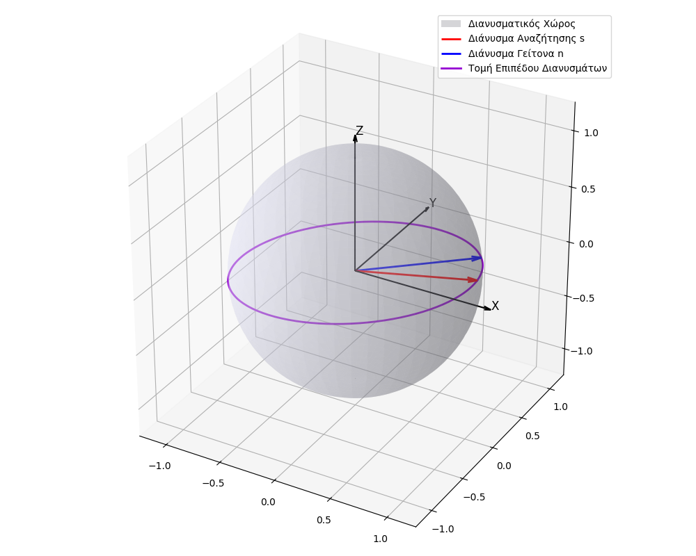
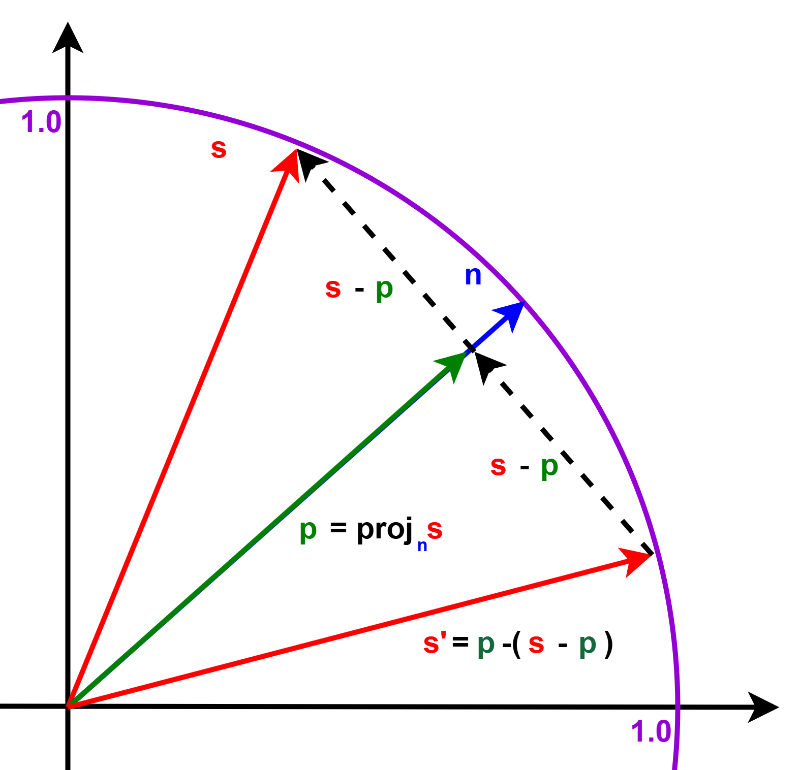

# MOSAIC: Model-based Orchestration of Semantic Assembly through Informed Composition
Developed as part of Master Thesis titled "Traceable linear code synthesis at scale"

**Dependencies:** Python 3.12<br>
**Contact:** Aimilia Palaska (aimilia.p2@gmail.com)<br>
**License:** Apache 2.0

## ⚡Quickstart
Clone this repository with `git clone https://github.com/emily-palaska/LlmBlockMerger-Diploma`<br>
Install requirements with `pip install -r requirements.txt`<br>

### Example of pre-processing pipeline

```python
from mosaic.load import init_managers, flatten_labels, create_blockdata, nb_variables
from mosaic.store import BlockDB
from mosaic.core import plot_sim, norm_cos_sim, LLM

paths = ['notebooks/dataset1/example_more.ipynb', 'notebooks/dataset1/pygrank_snippets.ipynb']
managers = init_managers(paths)

llama = LLM(task='question')
for i, manager in enumerate(managers):
    nb_variables(manager, llama)
    print(manager)

model = LLM(task='embedding')
embeddings = model.encode(flatten_labels(managers, code=True))
plot_sim(norm_cos_sim(embeddings), './plots/similarity_matrix.png')

db = BlockDB(empty=True)
db.create(embeddings=embeddings, blockdata=create_blockdata(managers, embeddings))
```
### Example of merging scenario

```python
from mosaic.store import BlockDB
from mosaic.core import LLM, print_synthesis
from mosaic.merge import string_synthesis, embedding_synthesis

query = 'Initialize a logistic regression model. Use standardization on training inputs. Train the model.'
model = LLM(task='embedding')
db = BlockDB(empty=False)
synthesis = string_synthesis(model, db, query)
print_synthesis(query, synthesis, title='STRING')
synthesis = embedding_synthesis(model, db, query)
print_synthesis(query, synthesis, title='EMBEDDING')
```

## 🧠About
MOSAIC utilizes pre-trained LLMs along with a vector database for retrieval augemntation to merge code blocks from natural language speficiations (queries). It can be divided into 5 functional modules:
- **core**: llm loading/quering, embedding operations and abstract syntax tree analyzers
- **load**: file pre-processing and block extraction based on comments and markdown text
- **store**: vector database initialization and functionality for accelerate retrieval of code blocks
- **learn**: MLP that applies transfer learning to the embedding space in order to enforce transitivity relation
- **merge**: two block synthesis mechanisms, based on string alteration or embedding projections

An abstracted high-level flow chart of the mechanism:
<p align=center>  

## 🧮Embedding Synthesis
This method is a unique element of the mechanism, which leverages vector operations to subtract infromation and iteratively query the vector database in order to retrieve blocks that implement a query. Its interest lies in the adaptation to the LLM's embedding space properties of semantic proximity between vectors. Below is a flowchart of the iterative algorithm

<p align=center>  

```python
from mosaic.load import BlockManager
from mosaic.core import projection, LLM, pivot_rotation
from mosaic.merge.merger import merge_variables
from mosaic.merge.order import synthesis_order
from mosaic.store import BlockDB
from torch import norm, tensor


def embedding_synthesis(model:LLM, db:BlockDB, query:str, k:float=0.9, l:float=1.4, t:float=0.05,
                        max_it:int|None=None, mlp:MLP|None=None, var:bool=True, rot:str|None=None):
    synthesis, last_nn = BlockManager(), None
    q = mlp(tensor(model.encode(query))[0]) if mlp else tensor(model.encode(query))[0]
    s = rand(q.shape) if rot == 'rnd' else q
    i = q.norm().item()

    for _ in range(max_it if max_it else q.shape[0]):
        if i < t: break # Break condition: Information norm below the norm threshold

        nn = db.read(s, limit=1)[0]
        if nn is None or nn == last_nn: break  # Break condition: No neighbors

        n = nn.embedding
        s, i, norm_proj = pivot_rotation(q, n, s, i, k, l, method=rot)
        if norm_proj < t and not rot=='rnd': break  # Break condition: Perpendicular embeddings (not for rnd)
        synthesis.append_doc(nn)
        last_nn = nn

    synthesis.rearrange(synthesis_order(synthesis))
    return merge_variables(model, synthesis) if var else synthesis
```

Intuitionally, we rotate the search vector on the intersection circle to continue the synthesis process (avoid repetition of the same nearest block) while maintaining cohesion between the chosen blocks.
<p align=center> 

Snippet of the [core](mosaic/core) module mathematical implementation: 
```python
from torch import Tensor

def projection(a, b):
    if not isinstance(a, torch.Tensor): a = torch.tensor(a)
    if not isinstance(b, torch.Tensor): b = torch.tensor(b)

    if torch.all(a == 0): return None
    dot = torch.dot(b, a) / torch.dot(a, a)
    return dot * a


def pivot_rotation(q: Tensor, n: Tensor, s: Tensor, i: Tensor, k: float, l: float, method:str|None=None):
    n_proj = projection(n, s)
    i_proj = projection(q, n)

    if method == 'rnd': s = rand(s.shape)
    elif method == 'rev': s = - n
    else: s = l * n_proj - s
    s /= s.norm()
    i -= k * i_proj.norm().item()
    return s, i, norm(n_proj).item()
```

<p align=center>  
